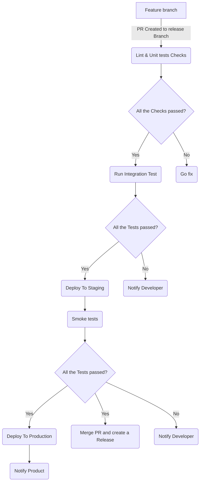

# Shimon's solution for Contractbook

Reports at: https://ohayonshimon.github.io/contractbook
## Some clarifications

1. I opened this GitHub account especially for this task, Don’t be alarmed by seeing an empty account.
2. I used the _last_updated_date_  field as a reference of the requirement for last submission date
3. I renamed USA to “United States” to match the dataset countries naming convention (Full names no acronym).
4. When fetching covid-19 dataset from source I used the [Latest](https://github.com/owid/covid-19-data/tree/master/public/data/latest) dataset URL
5. In some places in my code you will see the term “oldest_countries”, I refer to the countries that their last update date report time is the oldest.

## Task 1 - My Answers

**Q:** _How would your describe your ideal CI/CD setup?
    As part of this task, we would like to hear your opinions on assembling a CI/CD system in a company where it didn’t exist before, e.g. from scratch._
    _We are interested to hear which tools & services would you employ to build it and why._

**A:** My approach wiIl be to first analyze the type of releases and software development needs, Understand What the developers teams currently using.

And I will tailor the solution to cover as many corner cases as possible while still being agnostic enough to not over complicate the entire solution.

Ideally the CI/CD solution should be based on an easy to set up and easily maintained managed service like GitHub action, Bitbucket Pipeline or GitLab, preferably one of the industry standard offerings and not in-house developed one.

Here some of the advantage:

- Newcomers might be already familiar with the tool and way of working, Easy on-boarding.

- Using pay-as-you-go subscriptions fees. The costs increase together with the company size or number of developers.

- Built-in Integration and community contribution.

The main Idea will be to Develop the entire software lifecycle from inception to production under the same roof PR > Build > Test > Deploy > Test + Notifications for each step or failure.

All Development repositories will contain  minimum code that will import/fetch/copy the CI/CD code from centralize repository or even [remote trigger it](https://github.com/convictional/trigger-workflow-and-wait).

Here is an Exmaple of a complete CI/CD workflow (Using GitOps):

**Q:** _What would you optimize for and why? How would you go about debugging failed builds?_

**A:** I would optimize run time performance where needed, “heavy” testing jobs might require stronger CPU based machine.

I will compress artifacts before uploading where possible.
I will set retention-days as needed.

I will create quotas like [spending limits for GitHub Actions](https://docs.github.com/en/billing/managing-billing-for-github-actions/managing-your-spending-limit-for-github-actions#about-spending-limits-for-github-actions) and budget alerts to catch any long living jobs runs and main “abusers” of the service.

For debugging i will try to fetch the exception/errors lines of code and send it as part of the body of the slack notifications.

- Nice to have:
   Mapping of GitHub and Slack usernames to @mention the developers when needed

**Q:** _Would you collect any CI run statistics & for what purpose?_

**A:** Yes, Some meaningful information can be extracted from these metrics which can help us get a better understanding of the Company's development cycle and workflow stats

- How much time does the PRE tools and services “cost” the company? (From PR merged to Production)
- Does test executions take longer than they did in the past?
- How much do the developers use the company tools provided for them?
- Do we have “dead” or “stale” repositories in the Org?

Also, we “show off” our work.
As infrastructure engineers we don’t get to be in the spotlight a lot (mostly by choice :) ), It would be nice to collect some statistics of what we enabled the company to do in the past year/month/week, For example:

"This Year the PRE team enable the company to execute more than **12000 builds**, **14000 tests**, **300 production deployments** and **49 product releases**". Nice!

**Q:** _Any security considerations to be aware of?_

**A:** Yes Always.
We should take into account that when using managed service we are vulnerabile to the security practices and standards of this service. Almost in all cases this "Big" companies will have a decent way to do security But nevertheless its out of our hand. (For example Using old Docker engine with security exploit on the GitHub Actions runners).

Over time we should evaluate whats are  the risk-gain of using suc services.

Internally the Security mindset should start from the first line of code and up to the way we build and deploy our services. For example just like we don't commit sensitive  data into our code base we should avoid exposing any credentials and sensitive data in out CI/CI pipeline As well when integrating with 3rd party systems.

We also should make sure we don’t expose unwanted information in our public repositories about the way we do development release or the tools/infra we are using (.github/workflows directory).

**Q:** _How would you imagine this CI/CD integrates with feature development processes in the company?_

**A:** The CI/Ci solution usually relies heavily with the source code solution, Unless it was developed from scratch in-house (See first answer).
For future development processes the company should try to align to 1 way of working with minor adjustments as needed, The reasoning behind it is to keep the same “language” and skill-set across the company.
It will be easier to maintain and it will also be much easier for developers to change teams. For Exmaple... you two :)

That being said. Everything is open for discussion and we as PRE should be ready to adjust the solution according to business needs.

**Q:** _What else would you say is important when planning a CI/CD from scratch?_

**A:**

**Fail Fast** = Allow the developers to get a rough idea of the reason of a build or test failure from first glance. (Default when using GitHub actions matrix executions)

**Communicative** = In the end of the day this tool is designed to serve others across the company. People should not dig deep to understand the state of the pipeline.

**Agnostic** = Who knows maybe one day there will be a need to develop a feature in a new language - we should be prepared for that.

**Keep** it simple - No logic in Yaml,  Don’t create a mess of scripts and “if”’s.
Adopt an already working solution and don’t reinvent the wheel.

## Task 2 - See Code
